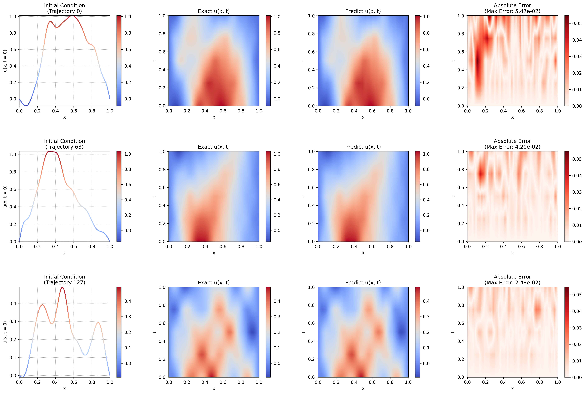

# Project 1: Fourier Neural Operator (FNO)

This folder contains implementation of the Fourier Neural Operator (FNO) [^1][^2]. We provide an example usage of training and evaluating our FNO for resolving the IBVP of 1D wave equation. The simplest model under `checkpoints/onetoall` is independent of time, but demonstrates good abilities to do superresolution and shows relatively small errors on both in-distribution and out-of-distribution (OOD) dataset.

Under `checkpoints/onetoall` and `checkpoints/all2all`, two time-dependent models are provided. Both of them are capable of predicting solution trajectories of the wave IBVP across time.

For more details, please see the project 1 section of the main project report, where we also discussed about the theoretical aspects of the FNO, such as its weaknesses for resolving problems on coraser grid, reflecting the fact that FNO is not ReNO (representation equivalent neural operator) [^3].


*Spatio-temporal solution for the Initial Boundary Value Problem (IBVP) of 1D homogeneous wave equation*

## Getting Started

> [!NOTE]
> The prediction file [results/prediction.txt](results/prediction.txt) is the redirection of the I/O by running `python3 evaluate.py > results/prediction.txt`.

### Evaluation

For the evaluation of task 1 - 3, we consider a model that is independent of time. It is trained by setting `time_dependent = False` and resides under the `checkpoints/onetoone` folder.

For the evaluation of task 4 & bonus, we provide two time-dependent FNO models that used All2All and One-to-All (Vanilla) data loading strategies respectively. The models are stored under `checkpoints/all2all` and `checkpoints/onetoone` respectively, under each subfolder for the model one can also see the training history, as well as the model & training parameters specified.

When running the following script, the evaluation for all task 1-4 & bonus will be proceeded, as long as the checkpoints contain corresponding pre-trained models.

```bash
python3 evaluate.py
```

Visualization will be stored under `results` and in particular for time-dependent evaluation under `results/time`

### Training

We have already provided trained models that can be directly used for evaluating all tasks, however, if you wished to try out different model & training configurations, you could use the following scripts for training. We seperate the training scripts for plain (without time) and time-dependent training here.


**Plain Training without Time**

For training the FNO model that can be used for evaluating task 1-3, run the following script if you wish to test out different parameters.

```bash
python3 train_fno.py
```

**Time-dependent Training**

By default, All2All strategy is used if no flags are passed.

```bash
# Using O(k²) samples per trajectory
python3 train_fno_with_time.py --mode=all2all
```

```bash
# Using O(k) samples per trajectory
# (0,1), (0,2), ..., (0, k) time pairs are used
python3 train_fno_with_time.py --mode=onetoall
```


[^1]: **Neural Operator: Learning Maps Between Function Spaces**  
    N. Kovachki, Z. Li, B. Liu, K. Azizzadenesheli, K. Bhattacharya, A. Stuart, A. Anandkumar  
    *Journal of Machine Learning Research (JMLR), 23, 1-97*  
    [[paper]](https://arxiv.org/abs/2108.08481)

[^2]: **Fourier Neural Operator for Parametric Partial Differential Equations**  
    Z. Li, N. Kovachki, K. Azizzadenesheli, B. Liu, K. Bhattacharya, A. Stuart, A. Anandkumar  
    *International Conference on Learning Representations (ICLR)*  
    [[paper]](https://arxiv.org/abs/2010.08895)
    [[blog]](https://zongyi-li.github.io/blog/2020/fourier-pde/)

[^3]: **Representation Equivalent Neural Operators: a Framework for Alias-free Operator Learning**  
    F. Bartolucci, E. de Bézenac, B. Raonić, R. Molinaro, S. Mishra, R. Alaifari  
    *Advances in Neural Information Processing Systems (NeurIPS), 36*  
    [[paper]](https://arxiv.org/abs/2305.19913)

[^4]: **Poseidon: Efficient Foundation Models for PDEs**  
    M. Herde et al.  
    *arXiv preprint*  
    [[paper]](https://arxiv.org/abs/2405.19101)
    [[project]](https://github.com/camlab-ethz/poseidon)


