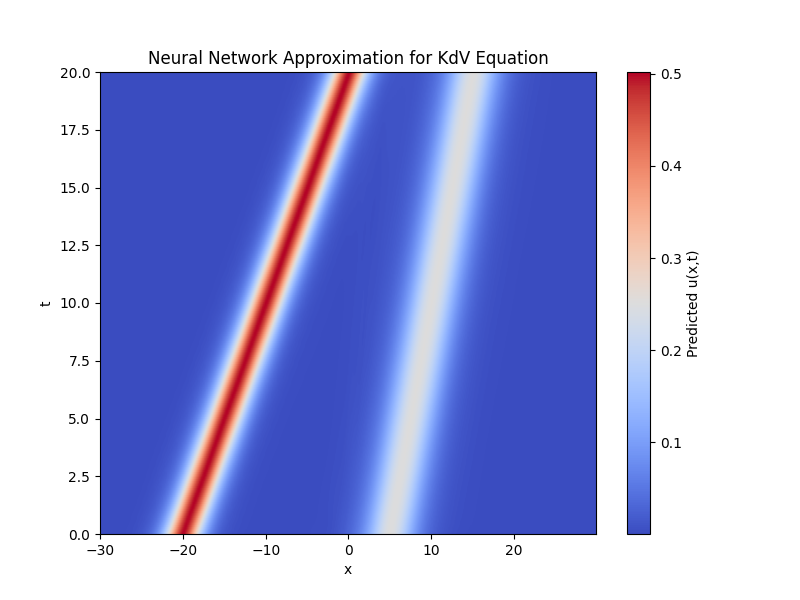
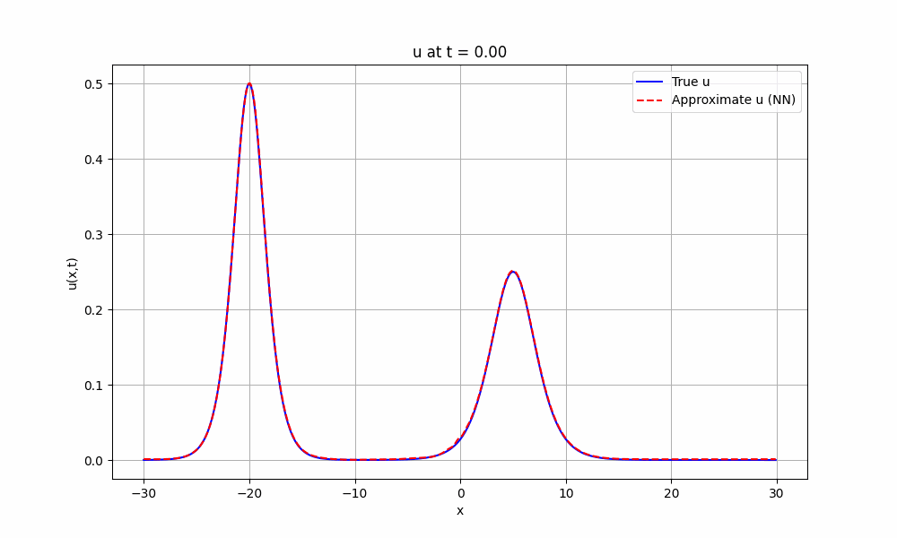

# Project 2: Reconstructing PDEs from Data Using PDE-Find

This project aims to use the PDE-Find method [^1] for symbolic regression of the governing equation of PDEs. The PDE-Find method is an extension of the SINDy method [^2] and it uses sparse regression to solve a linear system of equations (LSE) that contains the coefficients of the relevant terms of the governing equation as the unknown.

## Getting Started

We trained simple neural networks to approximate spatiotemporal solutions of the PDE, solely based on the provided `X.npz` dataset (for $X in {1,2,3}$) with

```python
# Train NN to approximate u(x,t) of the system 2
python3 train.py --system=2
```

Before we can use the trained NN to approximate our solution, we can compare it against the 

```python
# Test out the NN and compare it against the dataset ground truth
python3 test.py --system=2
```

This file will generate the a heat map of the approximated solution, as well as a gif showing the spatial-temporal evolution of the system. As we can see our approximation is of good quality, we can be reassured to further use the NN to compute derivatives.


| Approximate Solution Heatmap | Solution Comparison |
| --- | --- |
|  |  |


### Automatic Differentiation

We opted to use the neural network-based approach for computing derivatives. The main motivation of this is because we want to leverage the power of automatic differentiation.

```python
# Test out quality of approximation of the derivative computation
python3 differentiation.py --system=2
```

### Building the Feature Library


### Sparse Linear Regression for Solving the LSE


[^1]: **Data-driven discovery of partial differential equations**
    S. H. Rudy, S. L. Brunton, J. L. Proctor, and J. N. Kutz
    *Science Advances, vol. 3, no. 4, 2017*
    [[paper]](https://arxiv.org/abs/1609.06401)
 

[^2]: **Discovering governing equations from data: Sparse identification of nonlinear dynamical systems**
    S. L. Brunton, J. L. Proctor, and J. N. Kutz
    *Proceedings of the National Academy of Sciences of the United States of America, vol. 113, no. 15, pp. 3932–3937, 2015*
    [[paper]](https://arxiv.org/abs/1509.03580)