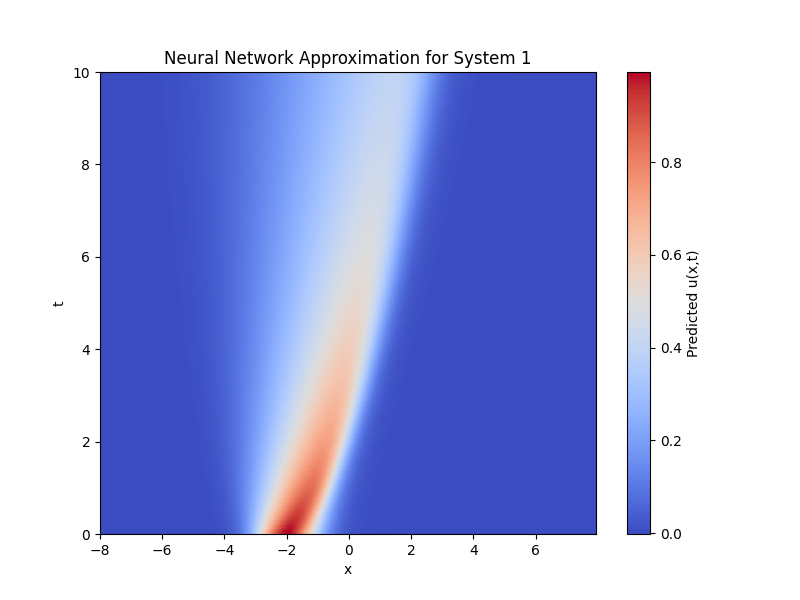

# Project 2: Reconstructing PDEs from Data Using PDE-Find

This project aims to use the PDE-Find method [^1] for symbolic regression of the governing equation of PDEs. The PDE-Find method is an extension of the SINDy method [^2] and it uses sparse regression to solve a linear system of equations (LSE) that contains the coefficients of the relevant terms of the governing equation as the unknown.

This `README.md` serves only as a brief overview on how to run our code. For more details, please see the project 2 section of the main project report.

## Getting Started

> [!WARNING]
> Please make sure to create a data folder `data/`, then install and unzip the source datasets `systems.zip` from [Polybox](https://polybox.ethz.ch/index.php/f/3927719498). Then move to the `data/` folder and then perform `unzip systems.zip` to obtain the data files `{X}.npz` for `X ∈ {1, 2, 3}` before performing predictions.

> [!NOTE]
> - The prediction file [`results/prediction_1.txt`](results/prediction_1.txt) is the redirection of the I/O by running `python3 evaluate.py --system=1 > results/prediction_1.txt`.
> - The prediction file [`results/prediction_2.txt`](results/prediction_2.txt) is the redirection of the I/O by running `python3 evaluate.py --system=2 > results/prediction_2.txt`.
> - The prediction file [`results/prediction_3.txt`](results/prediction_3.txt) is the redirection of the I/O by running `python3 evaluate_2d.py > results/prediction_3.txt`.

In project 2, we initially wanted to train simple feedforward neural networks (FNNs) on all three provided datasets, and then we can use the trained FNN to approximate the dataset better and then perform automatic differentiation to compute derivatives.

However, due to the high training cost, we only used *FNN + automatic differentiation* for the first two systems. For the third coupled system, we simply perform second-order accurate central differences method with first order estimates at the boundaries via [`torch.gradient`](https://pytorch.org/docs/stable/generated/torch.gradient.html) directly on the dataset.

## 1D Implementation (FNN + automatic differentiation)

For affordable 1D datasets, we trained simple neural networks to approximate spatiotemporal solutions of the PDE, solely based on the provided `X.npz` dataset (for $X \in \{1,2\}$ for $2$ different PDE systems) with:

```python
# Train NN to approximate u(x,t) of the system 1 or 2
python3 train.py --system=1
```

Before we can use the trained NN to approximate our solution, we can compare it against the ground truth using the provided dataset:

```python
# Test out the NN and compare it against the dataset ground truth for system 1 or 2
python3 test.py --system=1
```

This file will generate the a heat map of the approximated solution, as well as a gif showing the spatial-temporal evolution of the system. As we can see our approximation is of good quality, we can be reassured to further use the NN to compute derivatives. We also could visually already identify the first system to emerge from Burgers' equation, and the second system to be the Korteweg–De Vries equation (KdV equation) just from the animation and combined with the supplementary materials from the original paper [^1]. These assumptions will later be confirmed in our "Results" section too.


| System | Approximate Solution Heatmap | Solution Comparison |
| --- | --- | --- |
| System 1 |  |  |
| System 2 |  |  |

### Selecting Candidates

In order to be able to flexibly generate candidate derivatives and specify eligible binary operations to be performed, we use [SymPy](https://www.sympy.org/en/index.html) to generate the candidate symbols automatically.

The symbols can be passed to different actual compute kernels that compute the specified derivatives. In our implementation, we provide these derivatives via automatic differentiation on the trained neural networks that approximate our solution data.

### Automatic Differentiation

We opted to use the neural network-based approach for computing derivatives. The main motivation of this is because we want to leverage the power of automatic differentiation.

### Building the Feature Library

The feature library can now be built very easily because the results from automatic differentiation are already column vectors in our target shape. The only thing we need to do now is to assign these values column-wise to the $\Theta$ matrix.

We provide concise utility functions `build_theta` and `build_u_t` for assembling the sparse LSE that can be directly used in the upcoming regression. The implementation of the algorithm can be found under [`optimizers.py`](https://github.com/youwuyou/AISE/blob/main/project_2/optimizers.py)

### Sparse Linear Regression for Solving the LSE

We used `STRidge` algorithm as in the PDE-Find paper [^1] for obtaining sparse coefficient solution vector $\xi$. In addition, we also implemented the algorithm 2 `TrainSTRidge` as in the original paper for automatic selecting the best parameters based on customizable split on the dataset, this function wraps around the `STRidge` and is called instead.

## 2D Implementation (Direct `torch.gradient`)

For applying PDE-Find on 2D datasets, we did not train a FNN, but performed the `torch.gradient` directly on the dataset as we stated earlier. For simplicity, we place the utility functions for building the feature library for the 2D data directly within the `evaluate_2d.py` script.

For solving the LSE with sparse regression, we reused previous routines. The identical `TrainSTRidge` algorithm as for previous systems is used but with slightly different parameters. One can find the original parameters we used for the final report also in the script.

By passing `create_gif = True` to the `main` function of the `evaluate_2d.py` script, one can visualize the underlying solution $u$ and $v$ from the **original dataset** (`3.npz`) as animations. Based on the animations and the original paper [^1], we assume the system of PDEs to be the reaction-diffusion system:

| System | Original Solution $u$ | Original Velocity $v$ |
| --- | --- | --- |
| System 3 |  |  |

## Results

Our results on all three systems are plausible and match our expectations on the guess of the systems as in previous section. The systems are governed by Burger's equation, KdV equation and reaction-diffusion equation respectively.

### System 1 (FNN + automatic differentiation)

```python
# Run PDE-Find and obtain symbols of governing equation for system 1
python3 evaluate.py --system=1
```

running the PDE-Find algorithm based on 31 candidates

```
31 candidates: ['1', 'u', 'u**2', 'u**2*u_x', 'u**2*u_x**2', 'u**2*u_x**3', 'u**2*u_xx', 'u**2*u_xx**2', 'u**2*u_xx**3', 'u**3', 'u**3*u_x', 'u**3*u_x**2', 'u**3*u_x**3', 'u**3*u_xx', 'u**3*u_xx**2', 'u**3*u_xx**3', 'u*u_x', 'u*u_x**2', 'u*u_x**3', 'u*u_xx', 'u*u_xx**2', 'u*u_xx**3', 'u_x', 'u_x**2', 'u_x**3', 'u_xx', 'u_xx**2', 'u_xx**3', 'u_xxx', 'u_xxx**2', 'u_xxx**3']
```

we found the following equation for system 1:

$$u_t = -0.997335 \cdot u u_\mathbf{x} + 0.099140 \cdot u_\mathbf{x x} $$

With these coefficients, we compute the error between the LHS and the RHS and obtained for the first found PDE and got the relative L2 error is at around 3.140%.


### System 2 (FNN + automatic differentiation)

For the second PDE solutions given by the dataset `2.npz`, the same `evaluate.py` script is used, because we have again 1D solutions for one specific PDE:

```bash
# Similarly for system 2
python3 evaluate.py --system=2
```
with 13 candidate terms,

```bash
13 candidates: ['1', 'u', 'u*u_t', 'u*u_tt', 'u*u_x', 'u*u_xx', 'u*u_xxx', 'u_t*u_x', 'u_tt', 'u_tt*u_xx', 'u_x', 'u_xx', 'u_xxx']
```

we found the following equation for system 2:

$$
u_\mathbf{t} = -5.964117 \cdot u u_\mathbf{x} -0.987785 \cdot u_\mathbf{xxx}
$$

With these coefficients, we compute the error between the LHS and the RHS and obtained for the first found PDE, which is around 4.389%.

### System 3 (Direct `torch.gradient`)

To run the PDE-Find on the system 3:

```python
# Run PDE-Find and obtain symbols of governing equation for system 3
python3 evaluate_2d.py
```

we used 23 candidates function to build the feature library $\Theta$, which will be used in the LSE for both $u_\mathbf{t}$ and $v_\mathbf{t}$

```
candidates ['u', 'u_x', 'u_y', 'u_xx', 'u_yy', 'u_xy', 'u**4', 'u**3', 'u**2', 'v', 'v_x', 'v_y', 'v_xx', 'v_yy', 'v_xy', 'v**4', 'v**3', 'v**2', 'u*v', 'u*v**2', 'u**2*v', 'u*v**3', 'u**3*v']
```

We obtain the following two equations

$$
u_\mathbf{t} = 0.978845 \cdot u + 0.099731 \cdot u_{\mathbf{xx}} + 0.139817 \cdot u_{\mathbf{yy}} - 0.952589 \cdot u^3 + 0.993481 \cdot v^3 - 0.955152 \cdot u \cdot v^2 + 0.992257 \cdot u^2 \cdot v
$$

$$
v_\mathbf{t} = -0.987519 \cdot u^3 + 1.175099 \cdot v + 0.106914 \cdot v_{\mathbf{xx}} + 0.152016 \cdot v_{\mathbf{yy}} - 1.159284 \cdot v^3 - 0.999191 \cdot u \cdot v^2 - 1.160521 \cdot u^2 \cdot v
$$

each with an relative L2 error of $11.80157470703125$% and $12.238569259643555$% respectively.


[^1]: **Data-driven discovery of partial differential equations**
    S. H. Rudy, S. L. Brunton, J. L. Proctor, and J. N. Kutz
    *Science Advances, vol. 3, no. 4, 2017*
    [[paper]](https://www.science.org/doi/10.1126/sciadv.1602614)
 

[^2]: **Discovering governing equations from data: Sparse identification of nonlinear dynamical systems**
    S. L. Brunton, J. L. Proctor, and J. N. Kutz
    *Proceedings of the National Academy of Sciences of the United States of America, vol. 113, no. 15, pp. 3932–3937, 2015*
    [[paper]](https://www.pnas.org/doi/10.1073/pnas.1517384113)