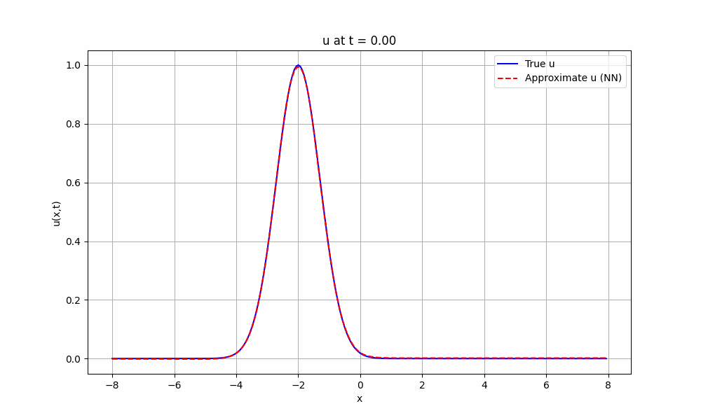
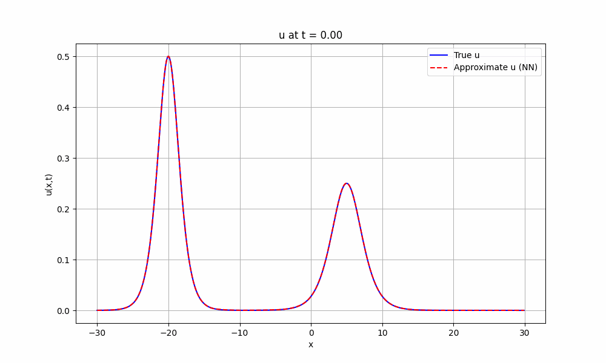

# Project 2: Reconstructing PDEs from Data Using PDE-Find

This project aims to use the PDE-Find method [^1] for symbolic regression of the governing equation of PDEs. The PDE-Find method is an extension of the SINDy method [^2] and it uses sparse regression to solve a linear system of equations (LSE) that contains the coefficients of the relevant terms of the governing equation as the unknown.

## Getting Started

We trained simple neural networks to approximate spatiotemporal solutions of the PDE, solely based on the provided `X.npz` dataset (for $X \in \{1,2,3\}$ for $3$ different PDE systems) with

```python
# Train NN to approximate u(x,t) of the system 2
python3 train.py --system=2
```

Before we can use the trained NN to approximate our solution, we can compare it against the ground truth using the provided dataset:

```python
# Test out the NN and compare it against the dataset ground truth
python3 test.py --system=2
```

This file will generate the a heat map of the approximated solution, as well as a gif showing the spatial-temporal evolution of the system. As we can see our approximation is of good quality, we can be reassured to further use the NN to compute derivatives.


| System | Approximate Solution Heatmap | Solution Comparison |
| --- | --- | --- |
| System 1 |  |  |
| System 2 |  |  |


### Selecting Candidates

In order to be able to flexibly generate candidate derivatives and specify eligible binary operations to be performed, we use [SymPy](https://www.sympy.org/en/index.html) to generate the candidate symbols automatically.

The symbols can be passed to different actual compute kernels that compute the specified derivatives. In our implementation, we provide these derivatives via automatic differentiation on the trained neural networks that approximate our solution data.

### Automatic Differentiation

We opted to use the neural network-based approach for computing derivatives. The main motivation of this is because we want to leverage the power of automatic differentiation.

```python
# Test out quality of approximation of the derivative computation
python3 differentiation.py --system=2
```

### Building the Feature Library

The feature library can now be built very easily because the results from automatic differentiation are already column vectors in our target shape. The only thing we need to do now is to assign these values column-wise to the $\Theta$ matrix.

We provide concise utility functions `build_theta` and `build_u_t` for assembling the sparse LSE that can be directly used in the upcoming regression.


### Sparse Linear Regression for Solving the LSE

TODO:


[^1]: **Data-driven discovery of partial differential equations**
    S. H. Rudy, S. L. Brunton, J. L. Proctor, and J. N. Kutz
    *Science Advances, vol. 3, no. 4, 2017*
    [[paper]](https://arxiv.org/abs/1609.06401)
 

[^2]: **Discovering governing equations from data: Sparse identification of nonlinear dynamical systems**
    S. L. Brunton, J. L. Proctor, and J. N. Kutz
    *Proceedings of the National Academy of Sciences of the United States of America, vol. 113, no. 15, pp. 3932–3937, 2015*
    [[paper]](https://arxiv.org/abs/1509.03580)