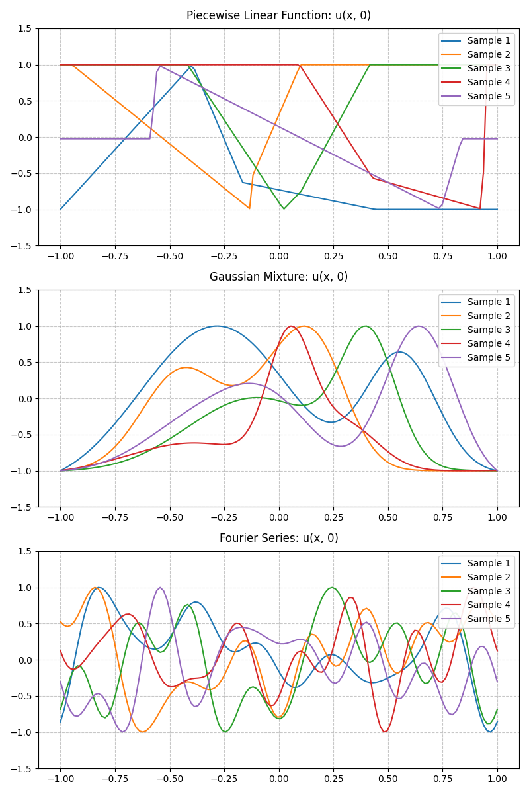
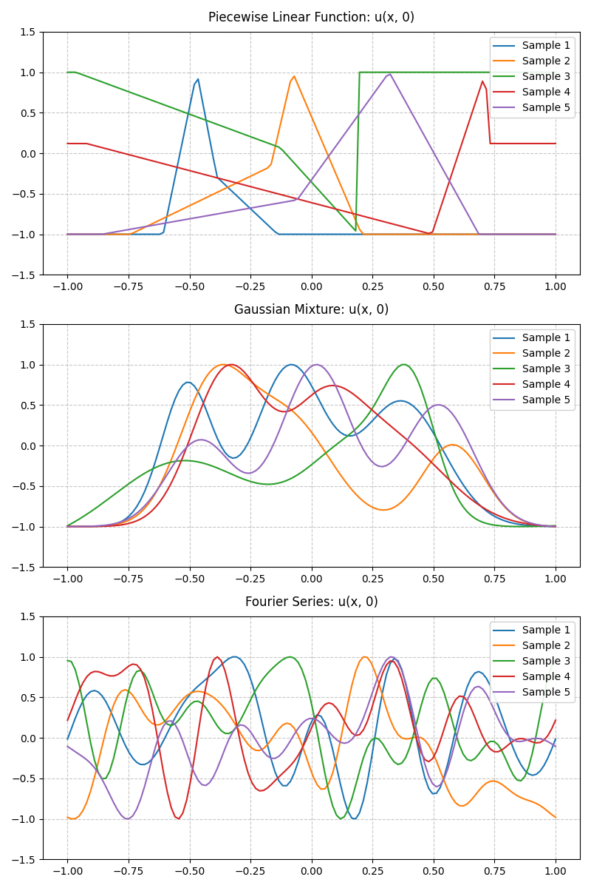
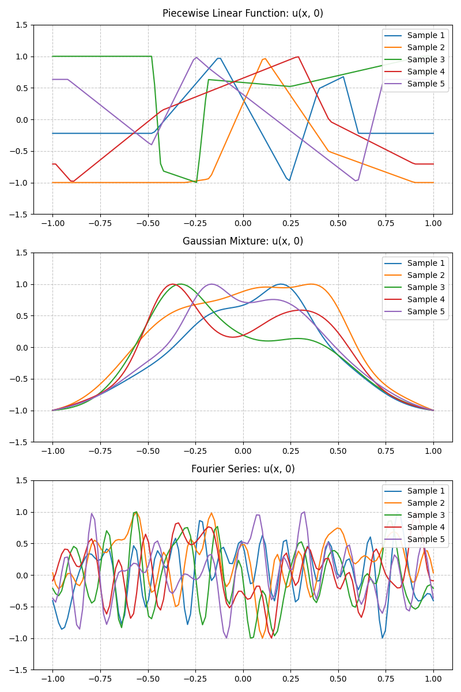
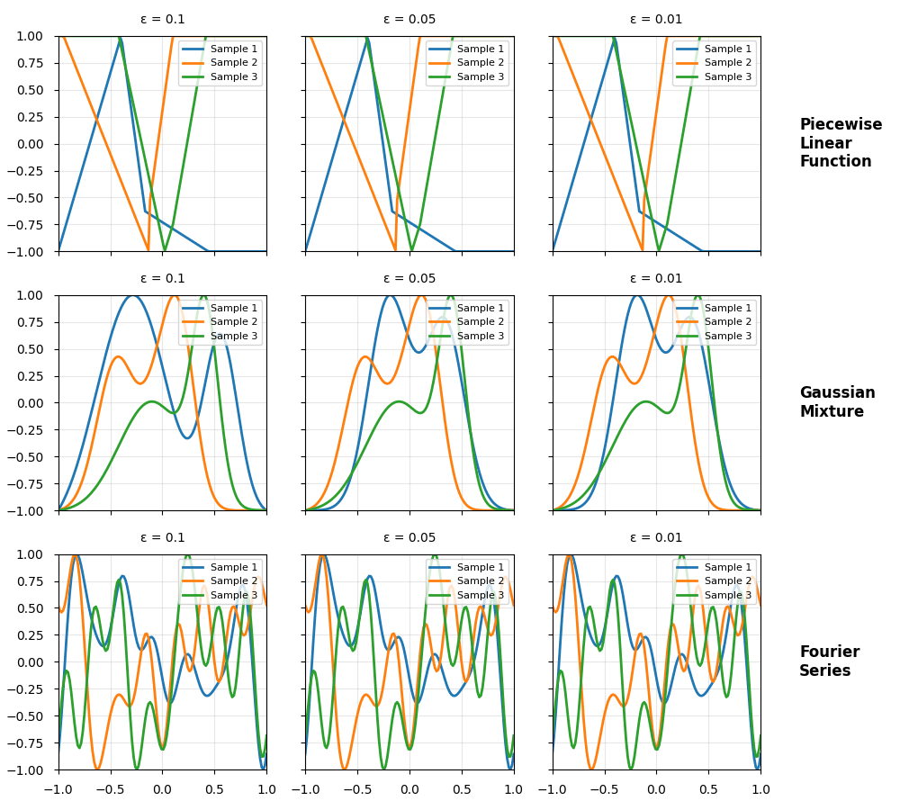
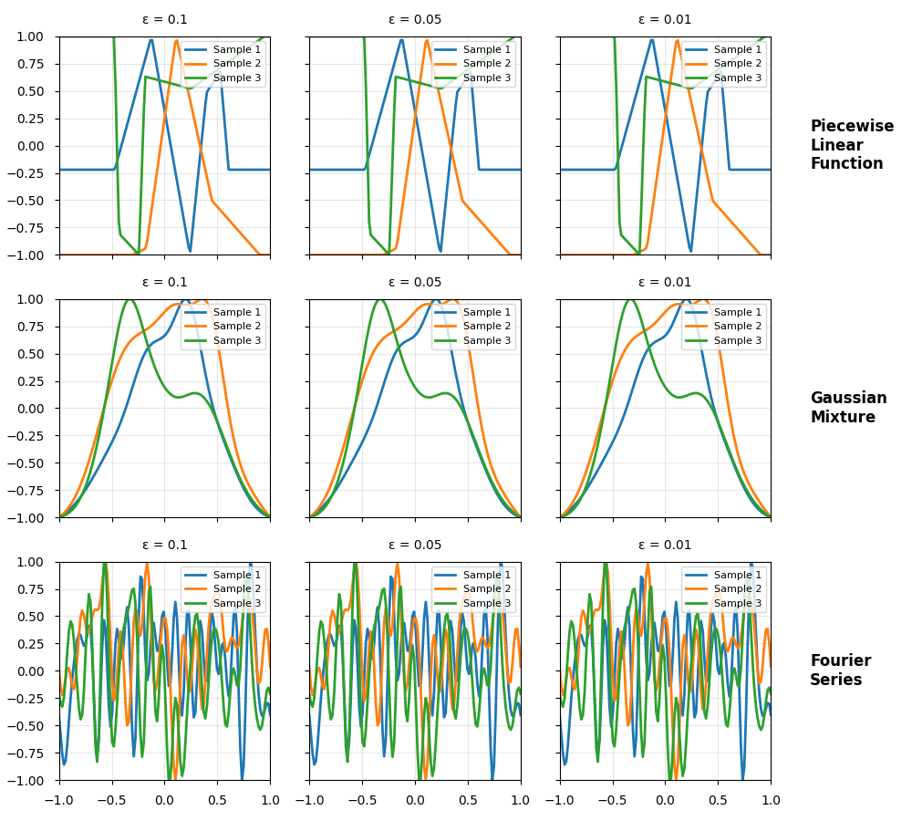

# Project 3: Foundation Models for Phase-Field Dynamics

In this project, we aim to train and evaluate a foundation model [^1]. Our implementation is based on the Fourier Neural Operator (FNO) [^2] as its architectural backbone.

Within the scope of our project, we consider the 1D Allen-Cahn equation:

$$
\frac{\partial u}{\partial t} = \Delta_{x} u - \frac{1}{\epsilon^{2}} (u^{3} - u), x\in [-1,1]
$$

with varying $\epsilon$ values.

## Getting Started

### Data Generation

For data generation, we need to first generate initial conditions (IC) $u_{0}= u(x, 0)$, and then solve the system with `scipy.integrate.solve_ivp`. To generate various types of initial conditions, we implemented three different samplers of the `FunctionSampler` class that provides three types of IC:

1. Piecewise Linear (PL)
2. Gaussian Mixture (GM)
3. Fourier Series (FS)


The generated datasets `train_sol.npy`, `test_sol.npy` and `test_sol_OOD.npy` are already included under `data/` folder. If one wish to reproduce the data generation, either run without flags:

```bash
python3 data_generator.py
```

Or one could also specify to just plot (`--plot`) or generate data (`--generate`), by passing flags respectively.

In the following table, one can see for each dataset 5 selected samples at initial time $t = 0$. The first two columns consist of in-distribution initial conditions, where we used samplers with default parameters. On the contrary, the OOD dataset `test_sol_OOD.npy` exhibits very distinct nature. We specified entirely different parameters at the initialization of each sampler, to let the sampled p.w. linear function to have more breakpoints, Gaussian mixture to include more components and the Fourier series to sum up to higher index for generating data of higher frequency pattern and sharper transitions. All the parameters used for data generation can be found under `config.json` for each data folder.


| Training Data (`train_sol.npy`) | Testing Data (`test_sol.npy`) | OOD Testing Data (`test_sol_OOD.npy`) |
| --- | --- | --- |
|    |      |      |

### Solution Trajectories Across 5 Timestamps

In total, a fixed number of timestamps `nt = 5` are used. The temporal grid is discretized uniformly, and thus all timesteps are of size $\Delta t = 0.0025$.


*Evolution of Selected trajectories at different ɛ from `train_sol.npy` (In-distribution)*


*Evolution of Selected trajectories at different ɛ from `test_sol_OOD.npy` (OOD)*


### Training


### Testing


### Fine-Tuning


[^1]: **Towards Foundation Models for Scientific Machine Learning: Characterizing Scaling and Transfer Behavior**
    S. Subramanian et al.
    *Advances in Neural Information Processing Systems, vol. 36, 2023*
    [[paper]](https://arxiv.org/abs/2306.00258v1)

[^2]: **Fourier Neural Operator for Parametric Partial Differential Equations**  
    Z. Li, N. Kovachki, K. Azizzadenesheli, B. Liu, K. Bhattacharya, A. Stuart, A. Anandkumar  
    *International Conference on Learning Representations (ICLR)*  
    [[paper]](https://arxiv.org/abs/2010.08895)
    [[blog]](https://zongyi-li.github.io/blog/2020/fourier-pde/)